# 🚀 Gas-Power-Compara v2.0 - Strategic Evolution Roadmap

**Data**: Luglio 2025  
**Versione Target**: 2.0.0  
**Evoluzione**: Lead Generation → Freemium SaaS  
**Timeline**: Q4 2025  

---

## 🎯 **Strategic Business Model Evolution**

### **From v1.0 to v2.0**
- **v1.0**: Pure lead generation con chiamate telefoniche
- **v2.0**: Dual-service freemium model con subscription premium

### **🔄 New Business Architecture**

```mermaid
graph TB
    A[Gas-Power-Compara v2.0] --> B[Free Tier]
    A --> C[Power Pro Premium]
    
    B --> D[Comparazione Tariffe Nazionali]
    B --> E[Lead Generation: +39 02 99 22 06 97]
    B --> F[Conversion to Premium]
    
    C --> G[€1.99/mese Subscription]
    C --> H[Alert Mensili Personalizzati]
    C --> I[Dashboard Efficientamento]
    C --> J[Consulenza Energetica Premium]
```



---

## 💰 **Power Pro Premium Service**

### **📋 Value Proposition**
- **Prezzo**: €1.99/mese (meno di un caffè!)
- **ROI**: 15,000% (€300+ risparmio annuale / €24 costo annuale)
- **Target**: Utenti privati per efficientamento energetico
- **Servizio**: Alert e notifiche mensili personalizzate

### **🎯 Premium Features**
1. **Alert Personalizzati**
   - Notifiche mensili nuove opportunità
   - Analisi personalizzata abitazione
   - Monitoraggio automatico mercato

2. **Dashboard Premium**
   - Tracking consumi personalizzato
   - Report mensili dettagliati  
   - Storico risparmi ottenuti
   - Grafici e analytics avanzati

3. **Consulenza Avanzata**
   - Raccomandazioni AI-powered
   - Supporto prioritario
   - Email/SMS alerts
   - PDF reports scaricabili

### **📊 Business Metrics Target**
- **Conversion Rate**: 15% free → premium
- **Churn Rate**: <5% monthly
- **LTV/CAC Ratio**: 3:1 minimum
- **MRR Growth**: €5,000+ by month 6

---

## 🏗️ **Technical Implementation Roadmap**

### **Phase 1: Foundation (Month 1-2)**
```typescript
// Authentication & User Management
- Supabase Auth integration
- User profiles & preferences
- Subscription status tracking
- Basic premium/free tier logic

// Payment Processing
- Stripe Subscriptions setup
- Billing cycle management
- Invoice generation
- Payment failure handling
```

### **Phase 2: Premium Features (Month 2-3)**
```typescript
// Premium Dashboard
- React Query real-time subscriptions
- Advanced charts (Recharts/D3)
- Personalized notifications center
- Savings tracking & analytics

// Notification System
- Email automation (Resend/SendGrid)
- Push notifications (PWA)
- SMS alerts (Twilio - optional)
- In-app notification center
```

### **Phase 3: AI & Personalization (Month 3-4)**
```typescript
// Smart Recommendations
- ML-powered savings opportunities
- Behavioral analysis & targeting
- Seasonal optimization alerts
- Predictive analytics

// Advanced Analytics
- User engagement tracking
- A/B testing premium features
- Conversion funnel optimization
- Churn prediction & prevention
```

---

## 🎨 **UI/UX Strategy**

### **🎁 Freemium Design Philosophy**
- **Free Tier**: Professional ma standard styling
- **Premium Tier**: Gradient premium, badge "PRO", animazioni
- **Upgrade Prompts**: Strategic placement, value-focused messaging

### **🔄 Conversion Funnel Design**
1. **Landing Page**: Dual CTA (Free + Premium preview)
2. **After Free Usage**: Upgrade modal con social proof
3. **Email Nurturing**: Automated follow-up sequence
4. **Limited Offers**: First month 50% discount

### **📱 Premium Visual Identity**
- **Colors**: Purple gradients, gold accents
- **Typography**: Bold headings, premium feel
- **Icons**: Lucide React con custom premium set
- **Animations**: Subtle hover effects, floating elements

---

## 📊 **Database Schema Extensions**

### **New Tables for v2.0**
```sql
-- Enhanced Users
users (
  id UUID PRIMARY KEY,
  email TEXT UNIQUE,
  phone TEXT,
  subscription_tier TEXT DEFAULT 'free', -- 'free', 'power_pro'
  onboarding_completed BOOLEAN DEFAULT false,
  preferences JSONB,
  created_at TIMESTAMP,
  updated_at TIMESTAMP
)

-- Subscriptions Management
subscriptions (
  id UUID PRIMARY KEY,
  user_id UUID REFERENCES users(id),
  stripe_subscription_id TEXT UNIQUE,
  stripe_customer_id TEXT,
  status TEXT, -- 'active', 'canceled', 'past_due', 'unpaid'
  current_period_start TIMESTAMP,
  current_period_end TIMESTAMP,
  plan_id TEXT DEFAULT 'power_pro_monthly',
  created_at TIMESTAMP,
  updated_at TIMESTAMP
)

-- User Home Profiles
user_profiles (
  id UUID PRIMARY KEY,
  user_id UUID REFERENCES users(id),
  home_size TEXT, -- 'small', 'medium', 'large'
  residents_count INTEGER,
  heating_type TEXT, -- 'gas', 'electric', 'hybrid'
  current_providers JSONB, -- {gas: 'provider', electricity: 'provider'}
  monthly_consumption JSONB, -- {gas_kwh: 150, electricity_kwh: 200}
  location_data JSONB, -- {city: 'Milano', region: 'Lombardia'}
  created_at TIMESTAMP,
  updated_at TIMESTAMP
)

-- Personalized Notifications
notifications (
  id UUID PRIMARY KEY,
  user_id UUID REFERENCES users(id),
  type TEXT, -- 'price_alert', 'new_offer', 'monthly_report', 'seasonal'
  title TEXT NOT NULL,
  content TEXT NOT NULL,
  estimated_savings DECIMAL(10,2),
  provider_info JSONB,
  cta_url TEXT,
  is_read BOOLEAN DEFAULT false,
  is_actioned BOOLEAN DEFAULT false,
  expires_at TIMESTAMP,
  sent_at TIMESTAMP,
  created_at TIMESTAMP
)

-- Savings Opportunities
savings_opportunities (
  id UUID PRIMARY KEY,
  user_id UUID REFERENCES users(id),
  opportunity_type TEXT, -- 'electricity', 'gas', 'bundle', 'efficiency'
  provider_name TEXT,
  offer_title TEXT,
  estimated_annual_savings DECIMAL(10,2),
  confidence_score DECIMAL(3,2), -- 0.00 to 1.00
  offer_details JSONB,
  comparison_data JSONB,
  expires_at TIMESTAMP,
  is_claimed BOOLEAN DEFAULT false,
  claimed_at TIMESTAMP,
  created_at TIMESTAMP
)

-- User Actions & Analytics
user_actions (
  id UUID PRIMARY KEY,
  user_id UUID REFERENCES users(id),
  action_type TEXT, -- 'opportunity_viewed', 'offer_clicked', 'report_downloaded'
  metadata JSONB,
  session_id TEXT,
  created_at TIMESTAMP
)
```

---

## 🔔 **Notification Strategy**

### **🎯 Alert Types Hierarchy**
```typescript
const NotificationTypes = {
  // High Priority (Real-time)
  urgent_savings: {
    trigger: "Exceptional offer (>€200 savings)",
    delivery: ["email", "push", "sms"],
    frequency: "immediate"
  },
  
  // Medium Priority (Daily/Weekly)
  price_alerts: {
    trigger: "New competitive rates in user area",
    delivery: ["email", "push"],
    frequency: "daily_digest"
  },
  
  // Regular Updates (Monthly)
  monthly_reports: {
    trigger: "End of month analysis",
    delivery: ["email", "dashboard"],
    frequency: "monthly"
  },
  
  // Seasonal (Quarterly)
  seasonal_opportunities: {
    trigger: "Seasonal energy pattern changes",
    delivery: ["email", "dashboard"],
    frequency: "seasonal"
  }
}
```

### **📱 Delivery Channels**
- **Email**: Primary channel (MailChimp/Resend)
- **Push**: PWA notifications for mobile
- **In-App**: Dashboard notification center
- **SMS**: Only for critical alerts (opt-in)

---

## 💎 **Premium Experience Design**

### **🎨 Visual Differentiation**
```css
/* Free Tier Styling */
.free-tier {
  @apply bg-white border-gray-200 text-gray-900;
}

/* Premium Tier Styling */
.premium-tier {
  @apply bg-gradient-to-br from-purple-600 to-blue-600;
  @apply text-white shadow-xl;
  animation: glow 2s ease-in-out infinite alternate;
}

.premium-badge {
  @apply bg-gradient-to-r from-yellow-400 to-orange-500;
  @apply text-purple-900 font-bold;
}
```

### **🎯 Upgrade Triggers**
1. **After 3 free comparisons**: "Unlock unlimited with Power Pro"
2. **High savings opportunity**: "Get alerts like this monthly"
3. **Email follow-up**: Value-focused upgrade sequences
4. **Exit intent**: "Wait! Save €300+ this year"

---

## 📈 **Revenue Projections v2.0**

### **Conservative Model (6 months)**
```typescript
const RevenueProjections = {
  // Current baseline (v1.0)
  monthly_visitors: 15000,
  free_signup_rate: 0.20, // 20% create free account
  
  // Premium conversion (v2.0)
  free_to_premium_rate: 0.15, // 15% upgrade to premium
  premium_retention_month_1: 0.85,
  premium_retention_month_6: 0.75,
  
  // Pricing
  power_pro_monthly: 1.99,
  
  // Month 6 Projections
  monthly_free_signups: 3000,
  monthly_premium_conversions: 450,
  active_premium_users_month_6: 1350,
  
  // Revenue
  month_6_mrr: "€2,686",
  year_1_arr_projection: "€48,000+",
  
  // Business Impact
  diversified_revenue: "40% from subscriptions",
  reduced_cac: "Premium LTV covers free acquisition"
}
```

### **Optimistic Scaling (Year 1)**
- **Monthly Visitors**: 25,000+
- **Premium Users**: 2,500+
- **Annual Revenue**: €75,000+
- **Market Position**: Leading premium energy consultancy

---

## ⚡ **Implementation Priority Matrix**

### **🔥 Critical Path (Month 1)**
1. **Supabase Auth Setup**
2. **Stripe Integration**
3. **Basic Premium Dashboard**
4. **User Profile System**
5. **Simple Notification System**

### **🎯 High Impact (Month 2)**
1. **Advanced Dashboard Features**
2. **Email Automation**
3. **Mobile-Optimized Premium UX**
4. **A/B Testing Framework**
5. **Analytics Implementation**

### **💎 Value Adds (Month 3-4)**
1. **AI-Powered Recommendations**
2. **Advanced Reporting (PDF)**
3. **Push Notifications (PWA)**
4. **Enterprise Features Foundation**
5. **Multi-language Support**

---

## 🎯 **Success Metrics Definition**

### **🔢 Quantitative KPIs**
- **Conversion Rate**: 15%+ free → premium
- **Monthly Churn**: <5% premium users
- **NPS Score**: 60+ for premium users
- **Support Tickets**: <2% increase despite 2x features
- **Revenue Growth**: 20%+ MoM for first 6 months

### **📊 Qualitative Indicators**
- **User Feedback**: Premium features satisfaction
- **Brand Perception**: Premium energy consultancy leader
- **Market Position**: Competitors benchmarking against us
- **Team Confidence**: Sustainable business model

---

## 🚨 **Risk Mitigation Strategy**

### **⚠️ Technical Risks**
- **Payment Processing**: Stripe backup with PayPal
- **Email Delivery**: Multi-provider setup (Resend + SendGrid)
- **Database Performance**: Supabase scaling + monitoring
- **User Experience**: Extensive testing pre-launch

### **💼 Business Risks**
- **Low Conversion**: Aggressive onboarding optimization
- **High Churn**: Engagement monitoring + retention campaigns
- **Competition**: Unique value proposition + network effects
- **Market Saturation**: Enterprise tier expansion ready

---

## 🎉 **Launch Strategy v2.0**

### **🚀 Pre-Launch (Month 1)**
- **Beta Testing**: 100 selected v1.0 users
- **Feedback Integration**: UX optimization based on beta
- **Content Creation**: Premium value prop materials
- **Email List**: Build anticipation with current users

### **📢 Launch Week**
- **Existing Users**: Upgrade prompts + first month 50% off
- **New Acquisition**: Premium-focused landing pages
- **Social Proof**: Beta user testimonials + case studies
- **PR Strategy**: Industry publications + energy blogs

### **📈 Post-Launch (Month 2-6)**
- **Optimization**: Daily metrics monitoring + rapid iteration
- **Feature Expansion**: User-requested premium features
- **Partnership**: Energy provider affiliate program
- **Scale Preparation**: Enterprise tier roadmap activation

---

**Status**: 📋 Ready for Technical Implementation  
**Next Step**: Phase 1 Development Kickoff  
**Target Launch**: Q4 2025  
**Success Criteria**: €5,000+ MRR by Month 6